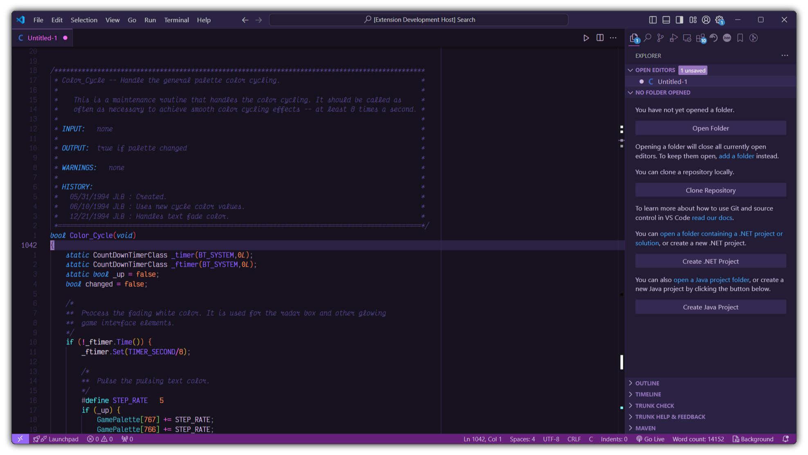

# Ayame

[](https://vscode.dev/theme/Nurdoidz.ayame/Ayame)

A theme for Visual Studio Code inspired by the nightly bright colors of cyber-neon anime.



## Install

To install, launch the Command Palette (default: `Ctrl`/`Cmd`+`P`), then run:

```
ext install ayame
```